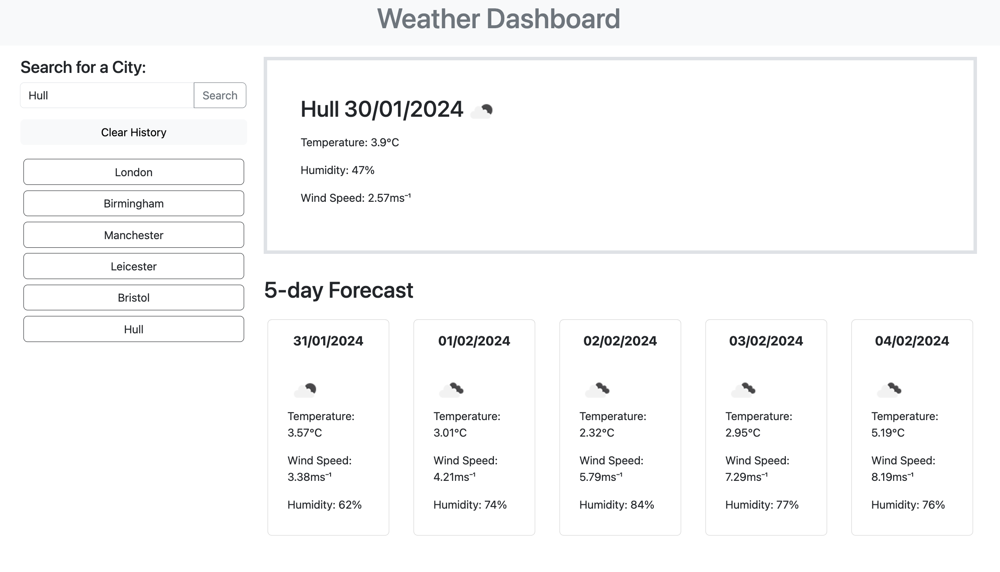

# weather-forecast-dashboard
5 day weather forecast dashboard created using javaScript and server-side API.

## Description
I have created a weather dashborad using a server-side API and JavasScript. It can be accessed at https://ramisachowdhury.github.io/weather-forecast-dashboard/

## Installation
N/A

## Usage
Use the search bar to check today's weather and the forecast for the coming 5 days in any city.

## Credits
The starter code for this challenge was provided by edX web development bootcamp.

## License
Please refer to the LICENSE in the repo-
